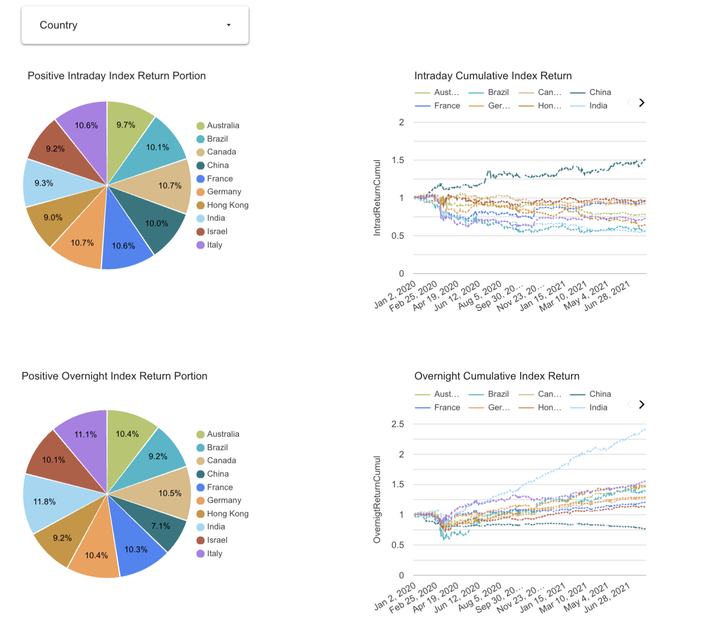

# Overnight Equity Indices Market Analysis
## Problem Description

1. **Motivation**

Overnight trading refers to the buying and selling of financial instruments outside of standard market hours, when major stock exchanges are closed. Price movements during this period can be driven by global events, news releases, and economic data, making the overnight window a dynamic and often volatile environment. Traders who engage in overnight strategies aim to capitalize on these developments while regular markets are inactive.

A 2010 study by Knuteson (2020) uncovered a striking and persistent anomaly: major global equity indices have exhibited significantly positive overnight returns, while intraday returns—those occurring during standard trading hours—have been consistently negative. This counterintuitive and systematic return pattern has been observed across decades and global markets, yet its origin remains unexplained.

This project revisits the anomaly using recent data to investigate whether this pattern still persists today, with a focus on its consistency across different regions and market conditions.

* Knuteson, B., 2020. Strikingly Suspicious Overnight and Intraday Returns. arXiv preprint arXiv:2010.01727

2. **Data Usage**

To explore this phenomenon, we utilized daily historical data for a diverse set of global stock indices collected via the `yfinance` Python package. The dataset spans from January 2020 to January 2025, and includes major indices from both developed and emerging markets such as:

* North America: QQQ, XIU.TO
* Latin America: EWW, EWZ
* Asia: 000001.SS, ^HSI, ES3.SI, ^N225, ^KS11, ^BSESN
* Europe & Australia: STW.AX, ^FCHI, ^GDAXI, IMIB.MI, ^TA125.TA

This broad set of indices ensures geographic and economic diversity, enabling us to examine the universality and variation of the intraday/overnight return patterns.

3. **Analysis**

The analysis decomposes daily stock returns into:
* Intraday return: Open-to-close price change
* Overnight return: Close-to-open price change

We then computed the average and cumulative returns for each component across the selected indices.

Our findings confirmed that the divergence between overnight and intraday returns continues to exist in recent years. This pattern is evident across most major equity indices, with China being a notable exception where the divergence is less pronounced or absent.

Furthermore, a significant portion of the equity risk premium appears to be captured overnight, while intraday returns in many cases display a negative risk premium. These results not only reaffirm earlier findings but also highlight the persistent and puzzling nature of this market anomaly in today’s financial environment.


## Project Architecture

1. **Infrastructure & Cloud**

Provisioned cloud infrastructure using **Terraform**, including resources for **Google Cloud** Storage (GCS) and BigQuery as the data warehouse.

2. **Data ingestion**

Orchestrated a scalable ELT (Extract, Load, Transform) pipeline using **Apache Airflow**, Apache Spark (PySpark), and Docker.

`Extract (Yahoo Finance Python Package)` -> `Load (Local -> GCS -> BigQuery)` -> `Transform (BigQuery -> PySpark -> BigQuery)`

3. **Data Warehouse**

Designed and built three core tables in **Google BigQuery**:

* `stock_trading_data_partitioned`: **Partitioned** and **clustered** to optimize performance for large-scale queries.
* `stock_country_data_materialized`: Contains ticker-level categorical metadata.
* `stock_return_data`: Stores computed intraday and overnight returns as well as cumulative returns.

4. **Transformation**

Utilized **PySpark** to perform data transformations: loading raw data from BigQuery, computing return metrics, and writing the transformed results back to BigQuery for further analysis.

5. **Dashboard**

Built an interactive dashboard using **Google Looker Studio** to visualize return patterns and compare performance across global indices.

[Google Looker Studio Dashboard Link](https://lookerstudio.google.com/reporting/d592ce0c-e122-471c-b9c4-eed7983dc0b0)




## Steps to Reproduce

### Terraform
Use Terraform to provision the required infrastructure based on the configuration in the `.env` file.

1. **Create a GCP Project**

In Google Cloud, create a new project named `overnight-stock-price-analysis`

2. **Create a Service Account**

In Google Cloud "IAM & Admin" / "Service accounts", create a new service account and grant the following access roles
    
* `BigQuery Admin`
* `Dataproc Administrator`
* `Storage Admin`

3. **Generate a Service Account Key**

    1. Go to the service account → Keys → Click "Add Key" → Select "JSON"
    2. Save the key as `google_credentials.json` in your project directory

4. **Configure Environment Variables**

    1. Rename `.env_example` to `.env` in the project directory
    2. Update the `<<proj_dir>>` with your actual project directory path

5. **Initialize and Apply Terraform**

In the project `terraform/` directory, run:
```
terraform init
export $(grep -v '^#' ../.env | xargs)
terraform plan
terraform apply
```

6. **Resolve Any Permission Issues**

    1. Enable required APIs or permissions as prompted
    2. Rerun failed commands if needed

7. **Verify Resource Creation**

Confirm that the GCS bucket and BigQuery schema are created

8. **Destroy Infrastructure (Optional)**

When you are done, you can clean up resources:
```
terraform destroy
```


### Docker + Airflow Pipeline
Use Docker to containerize and orchestrate the data extraction, loading, and transformation processes with Airflow.

1. **Build and Start Docker Containers**

From the project root:
```
cd <<proj_dir>>/overnight-stock-price-analysis/
docker-compose build
docker-compose up -d
```

2. **Access Airflow Web UI**

    1. Open your browser and go to: http://localhost:8080
    2. Login credentials:
        * Username: `admin`
        * Password: `admin`

3. **Trigger the DAG**

Trigger the `data_extract_load_transform_dag` with the following configuration:
```
{
    "tickers": "['QQQ','XIU.TO','EWW','EWZ','000001.SS','^HSI','ES3.SI','^N225','^KS11','^BSESN','STW.AX','^FCHI','^GDAXI','IMIB.MI','^TA125.TA']",
    "start_month": "2020-01",
    "end_month": "2025-01"
}
```

4. **Verify BigQuery Tables**

Confirm the creation of the following tables:
* stock_trading_data_partitioned
* stock_country_data_materialized
* stock_return_data

5. **Stop Containers (Optional)**

When finished:
```
docker-compose down
```